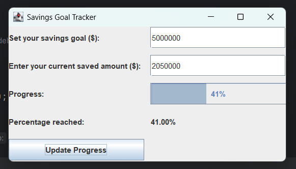

# SaveWise – Savings Goal Tracker

## Overview
SaveWise is a Java Swing-based desktop application that helps users track their savings progress toward a financial goal.

## How to Run
1. Clone the repository
2. Open in IntelliJ IDEA
3. Run SavingsGoalTracker.java

## Future Enhancements
- Dark mode support
- Savings history tracking
- Monthly savings analysis
- Export reports
  
## Features
- Set a savings goal
- Enter current savings amount
- Progress bar visualization
- Percentage calculation
- Input validation
- User-friendly GUI

## Technologies Used
- Java
- Swing
- Event Handling
- Exception Handling

## Screenshot

## Author
Chethana M M
